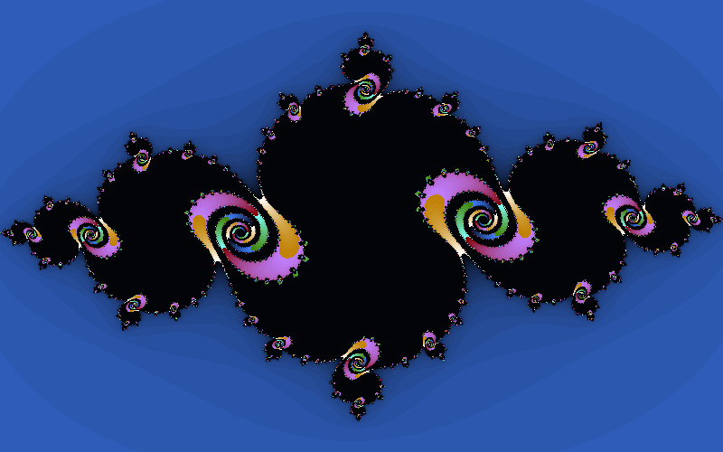

# Rust React

See the [medium article](https://medium.com/@Jayseabee/rust-react-part-i-3a33c3da9ca0) for overview.

# Running the app

Assuming you have Rust development environment set up, including cargo. If not see the [Rust Getting Started](https://www.rust-lang.org/learn/get-started).

Similarly, we need a [React development environment](https://reactjs.org/docs/create-a-new-react-app.html) with `node` and `npm` installed.

## Rust Actix Server

To start the Rust server simply go for:
`cargo run --release`

This will bring up the REST endpoint and the websocket handler using Actix.

If you want to test the Julia Set generator you can use the `julia_test` in `julia.rs` by running `cargo test --release`. Note: the test script generates quite a large 8000x5000 image by default and can take a bit of time to complete, depending on your CPU.

## React App

To run the app in development mode go for `npm run build` followed by `serve -s build`, in the `react-app/` directory. But if you are experimenting then just go for `npm start` to run in development mode.
